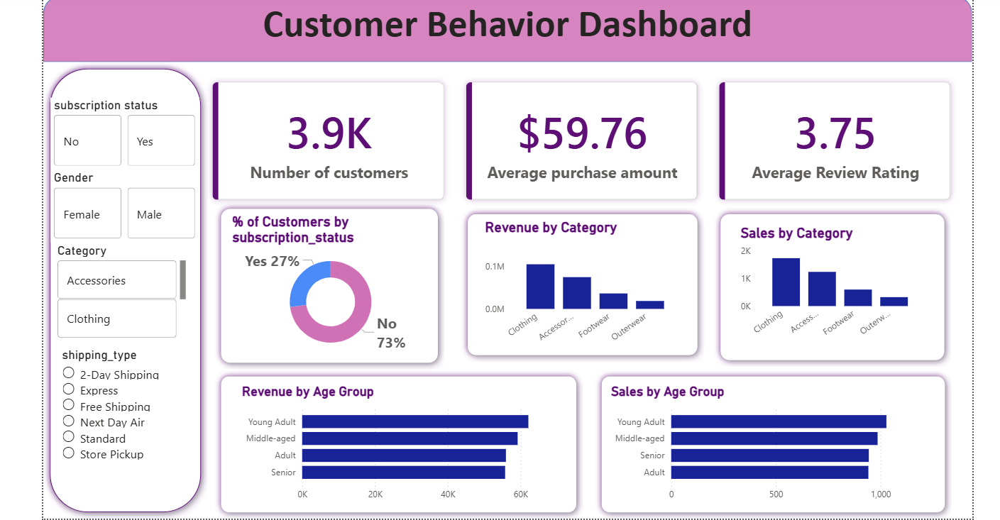

# customer-shopping-behavior-analysis
Customer shopping behavior analysis using Python, SQL, and Power BI

## Project Overview
This project analyzes customer shopping behavior to identify patterns in spending, discounts, product ratings, and customer segments.

## Tools Used
- Python (Pandas, Matplotlib)
- SQL
- Power BI
- Jupyter Notebook

## Dataset
Customer shopping dataset containing around 3900 records with features such as age, gender, purchase amount, product category, discount applied, and review ratings.

## Analysis Performed
- Data Cleaning using Pandas
- Exploratory Data Analysis
- SQL Queries for customer insights
- Power BI dashboard for visualization

## Key Insights
- Identified purchasing patterns across different customer segments
- Analyzed the impact of discounts on customer purchases
- Evaluated product ratings and customer satisfaction
- Visualized customer behavior trends

- ## Dashboard Preview

## Author
Sai Pavan Amera
Master's in Computer Science – Florida Atlantic University
